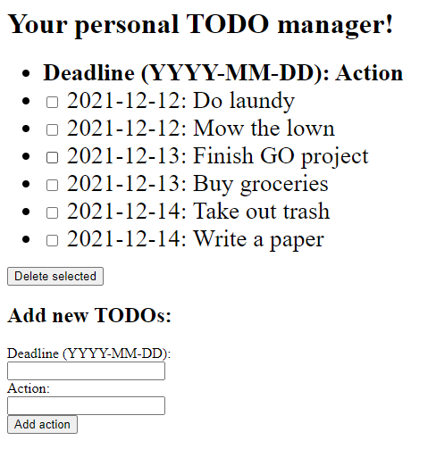

# TODOserver
A simple server written in GO using <a href="https://github.com/gin-gonic/gin">gin</a> and <a href="https://gorm.io/index.html">gorm</a>.

## Getting started
### Download the repository
```
docker build -t todoserver .
docker run -p 8888:8888 -it --name todoserver todoserver
```

### Launch the server via docker
Launch:
```
docker build -t todoserver .
docker run -p 8888:8888 -it --name todoserver todoserver
```
Restart:
```
docker start -i todoserver
```
Cleanup docker:
```
docker system prune -af
```

### Or launch without a container:
```
go build -o main .
./main
```
## Features
You can access the HTML interface at <a href="http://localhost:8888">localhost:8888</a>:



You can add and remove items from the TODO list.
